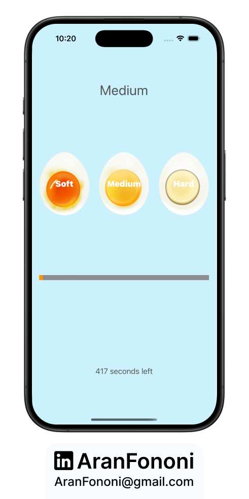
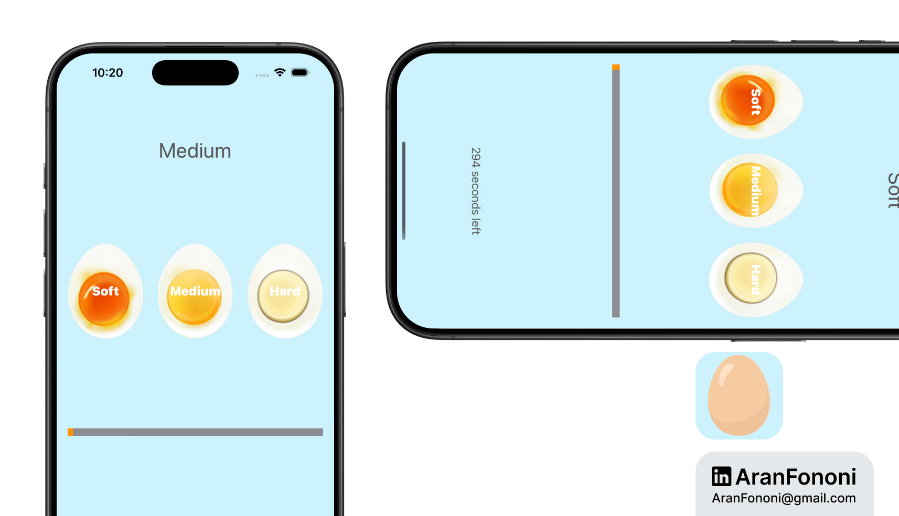

# Egg Timer App

### Project for Section 8: **Timers and AVFoundation**  
This project was completed as part of Section 8 in the **Complete iOS Development Bootcamp** by Angela Yu.

## Project Overview
The **Egg Timer App** is a cooking timer designed to help users boil eggs to their preferred level of doneness (Soft, Medium, Hard). It features a progress indicator and audio notifications when the timer completes.

## What I Learned
In this project, I focused on:
- **Timers in Swift**: Implemented a countdown timer for cooking eggs.
- **Audio Feedback**: Utilized AVFoundation to play an alarm sound when the timer finishes.
- **User Interface**: Created a UI that updates in real time, showing remaining time and progress.

## Key Skills
- Managing timers and their states
- Working with AVAudioPlayer for sound playback
- Creating a responsive user interface in UIKit

## Additional Features
I enhanced the standard timer by including a countdown display, which shows the remaining time as it decreases. This feature was beyond the course requirements.

---

### Project Preview

---

### Footer

---

## Contact
For more information, feel free to reach out:  
- **Email**: [aranfononi@gmail.com](mailto:aranfononi@gmail.com)  
